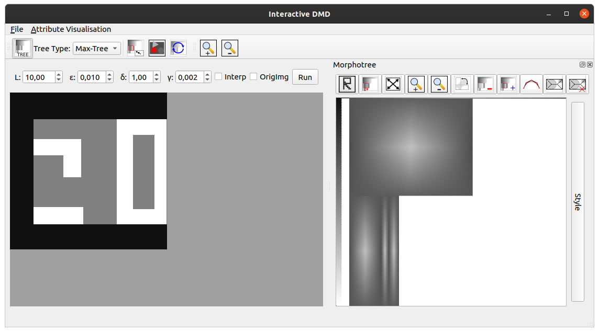
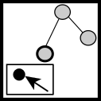

This software is used for manipulating images interactively.  

# 1. Building

The software needs a C++ compiler, the CUDA, [conan](https://conan.io/),  and Qt to build. The program depends on some custom packages. To install a conan package, we need to run a conan command at the root of the repositories on the links down below. 

- [morphotree library](https://github.com/dennisjosesilva/morphotree) 

```bash
$ conan create . morphotree/0.0.1@dennisjosesilva/dev
```

- [IcicleMorphotreeWidget](https://github.com/dennisjosesilva/IcicleMorphotreeWidget)

```bash
$ conan create . IcicleMorphotreeWidget/0.0.1@dennisjosesilva/dev
```

- [ImageViewerWidget](https://github.com/dennisjosesilva/ImageViewerWidget)

```bash
$ conan create . ImageViewerWidget/0.0.1@dennisjosesilva/dev
```

- [Spline](https://github.com/WangJieying/Spline)

```bash
$ conan create . Spline/0.0.1@jieyingwang/dmd
```

- [Skel](https://github.com/WangJieying/Skel)

```bash
$ conan create . Skel/0.0.1@jieyingwang/dmd
```

# 2. Running

mkdir build

cd build

conan install ..

cmake ..

make

./bin/interactive-dmd 

# 3. Functions

### Morphotree widget and node selection

The morphotree widget is an alternative representation of the image. In this widget, we render a max-tree (one of the types of common morphological trees). In this tree, each node represents a connected component of an upper-threshold. The child nodes are connected components that are subsets of their parent node. An simple example is shown down below:



In this figure, we can see tree nodes representing the connected components in white that span from gray to white at the graphical representation of tree. These nodes are children of a bigger node that spans from black to gray. This node contains the previously small tree nodes. Finally the root node in black that contains the bigger node.

### Usage:

#### Node selection and unselection

The main way to interact of the morphotree widget is to select nodes. We can select nodes using two ways:

1) *Direct node selection*: we can select a node by click on it on the morphotree widget. When selected, the node got a red border.

2) *Pixel node selection*: we can activated node selection by pixel clicking on   . When it is activated, we can click at a pixel of the input image and select smallest node that contains that pixel.

In both ways, we can select more than a node by clicking on the node or pixel with the *SHIFT* key down. Also, we can select all descendant nodes of the nodes that are already selected by clicking on  . 

When we click in a node that is already selected, it gets unselected. If the _SHIFT_ key is down, the selection of the other nodes are kept, otherwise all nodes gets unselected.

#### Node visualisation and reconstruction

We can visualise the connected component represented by the selected nodes by two ways:

1. *Visualise direct on the image*: We can visualise the nodes direct in the image viewer, by activating this features using the button  . When it is activated, the connected component represented by the node is painted in red at the image viewer.

2. _Node reconstruction:_ We can visualise the selected nodes in an dock window as a binary image. To do it, we can press the button  to reconstruct the selected nodes.
   
   

#### Manipulate tree rendering

We can also manipulate some aspects of the tree rendering for a better visualition. Down below we list some of these commands:

1. *Zoom in*: We can apply a zoom in at the tree rendering by pressing *+* (plus) or clicking on .

2. *Zoom out*: We can apply a zoom out at the tree rendering by pressing *-* (minus) or clicking on .

3. *Fit to window*: We can fit the tree rendering to the dock window by pressing *0* (zero) or clicking on .

4. *Rotate tree*: We can rotate the tree to display it vertically or horizontally by clicking on .

5. *Pan*: We can navigate the rendering using pan by holding *Alt* key down.

#### Attributes visualisation

We can visualise some attributes using a colourmap rendering of the nodes. To do it, we can click on *Attribute Visualisation* at the menu bar and chose an attribute to visualise. To remove the attribute visualisation, we have to click in the *Attribute visualisation* menu and unchecked the attribute.

#### Removing and include nodes for SDMD reconstruction

Using the morphotree widget, we can also remove nodes from the SDMD reconstruction and add then back. The commands to do that are described down below:

1. *Removing nodes*: We can remove the selected nodes from the DMD reconstruction by clicking on . When we do it, the removed nodes are rendering using semi-transparent colours.

2. *Including nodes*: We can include back the selected removed nodes by click on . When we do it, the remove nodes are rendering using the full (no transparency) colour again.

3. We can also apply the DMD method for connected component removal by clicking on the button *Run* below the menu bar. The selection of the nodes corresponds to the DMD connected components removal strategy defined by the parameters on the spin boxes. After clicking on run the removed nodes are rendering in semi-transparent colours at the morphotree widget.

4. We reconstruct the image without the removed nodes using the SDMD pipeline by clicking on . After clicking on it, the image on the left panel will show the reconstruction result.

#### Tree synchronisation

The tool can change the skeleton of the nodes to produce other connected  components as described at the section **Shape manipulation**. When this happen, the reconstruction image gets unsynchronised with the tree. In this case, the node selection funcionality can get unexpected results. In order to make the manipulated image corresponding to the max-tree of the widget the user should synchronise the tree. 

When tree gets unsynchronised (the user apply a skeleton manipulation) the border of the image gets yellow  and a message is shown in the status bar as shown in the image below:


To synchronise the image to the tree, the user can click on  at the toolbar. When the image and tree is synchronised, it cannot go back to the previous status and the whole tree and node skeletons are recomputed.


Shape manipulation
---------

**Usage**:
Select node(s) that you want to manipulate in the 'Morphotree' window and then press this icon: , then you will enter the shape manipulation window, as shown in the following image.


**Instructions**:

1. 
   
After pressing this button, the control points (CPs) of the shape(s) will be displayed. Each shape has one or several branches. Each branch has one or more CPs. The color of each branch indicates its degree, and their corresponding relationship is displayed at the bottom of the window.

2. 

This button will undisplay all CPs.

3. 

This button is used for adding one CP in a branch. So first you need to select a branch (by clicking any CP on it), then click the button, next click where you want to add the CP. Note that if you want to add a CP in the middle of a branch, please click between the rectangle formed by the front and back CPs. If not, you will add a new branch with two CPs.

4. 

This button is used for deleting one CP in a branch. So first you need to click the CP that you want to delete and then click this button.

5. 

This button is used for deleting a whole branch. So first you need to select a branch (by clicking any CP on it) that you want to delete and then click this button.

6. 

This button is used for deleting multiple CPs. You can select multiple CPs at once by the rubber band drag mode of the mouse, and then click this button to delete all the selected CPs.

7. 

This button is used for rotating all the selected CPs. First, you need to click this button and then click on the image where you want to put focus. Next, select all the CPs that you want to process. Then hold down the "R" key and scroll the mouse wheel to the angle you want.

8. 

This button is used for scaling all the selected CPs. First, you need to click this button and then click on the image where you want to put focus. Next, select all the CPs that you want to process. Then hold down the "Z" key and scroll the mouse wheel to scale up/down of the CPs.

In addition to the above operations, you can also **move** CP(s) directly on the shape, change the **radius** or **degree** of a CP, and **copy**/**cut** CP(s), as follows.

9. *Change the radius:* First, select a CP, and then hold down the shift key, and next scroll the mouse wheel to increase/decrease the radius. Its radius is shown on the right corner of the window.

10. *Chang the degree:* First, select a CP, and then hold down the "D" key, and next scroll the mouse wheel to increase/decrease the degree. Its degree is shown on the right corner of the window. Note that after changing the degree of this CP, the degree of other CPs on the same branch will also be changed.
    For detailed explanation about *degree* of a spline, please check this [link](https://www.geometrictools.com/Documentation/BSplineReduction.pdf).

11. *Copy CP(s) to another location:* First, select all CPs you want to copy (note that even though only one CP in a branch is selected, the whole branch will be copied), and then press the "C" key. Next, click on the image with the mouse to indicate where you want to put the pasted CPs. Next, click the "V" key, then all the CPs will be copied to the position you clicked. 

12. *Cut CP(s) to another location:* First, select all CPs you want to cut (note that even though only one CP in a branch is selected, the whole branch will be cut), and then press the "X" key. Next, click on the image with the mouse to indicate where you want to put the pasted CPs. Next, click the "V" key, then all the CPs will be pasted to the position you clicked. Note that unlike copy, the cut CPs can only be pasted *once*.

After you have done any of the above operations, click the 'Reconstruct CC' button to view the new/changed reconstructed result of the current shape. You can also click the 'Reconstruct Image' button to view the new/changed reconstructed result of the original image.

A shape manipulation example can be found [here](images/demo.mp4).


# 4. Other remarks

